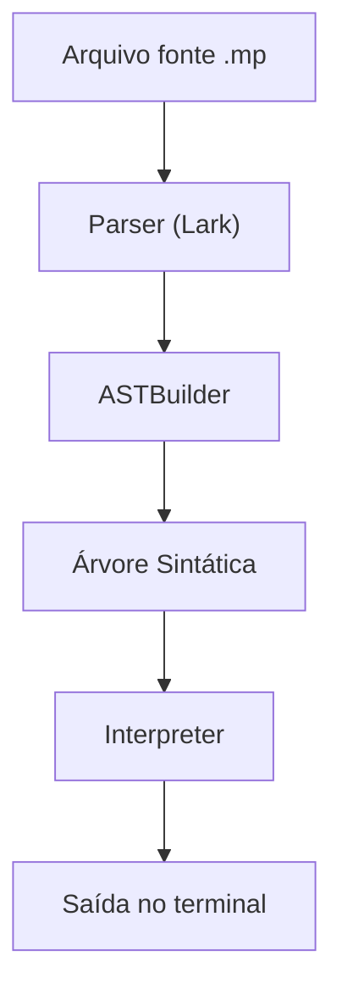

# Trabalho_Compiladores

## Descrição

Este projeto implementa uma linguagem de programação simples, interpretada em Python usando a biblioteca [Lark](https://github.com/lark-parser/lark). A linguagem suporta operações aritméticas, operadores de comparação e lógicos, atribuição de variáveis, comandos de impressão (`imprima`), estruturas condicionais (`if`), de repetição (`while`), **strings** (com acentuação), **concatenação de strings**, **funções definidas pelo usuário** e **comentários**.

## Sintaxe da Linguagem

- **Atribuição:**
  ```
  x = 10
  y = x * 2 + 5
  texto = "Olá, mundo!"
  ```
- **Impressão:**
  ```
  imprima(y)
  imprima("Mensagem com acentuação: çãõé")
  imprima("Oi, " + "Lucas!")
  imprima("Valor: " + 123)
  ```
- **Operadores de comparação:**
  - `==`, `!=`, `<`, `>`, `<=`, `>=`
  ```
  imprima(2 == 2)  # True
  imprima(3 > 5)   # False
  imprima("a" != "b")  # True
  ```
- **Operadores lógicos:**
  - `and`, `or`, `not`
  ```
  imprima(2 == 2 and 3 > 1)  # True
  imprima(not (2 > 3))       # True
  ```
- **Concatenação de strings:**
  - Use `+` para juntar strings ou strings e números:
    ```
    nome = "Lucas"
    imprima("Olá, " + nome)
    imprima("Resultado: " + 42)
    ```
- **Comentário:**
  - Qualquer texto após `#` na linha é ignorado:
    ```
    imprima("Olá!")  # Isso é um comentário
    ```
- **Funções definidas pelo usuário:**
  - Defina funções com `def` e retorne valores com `return`:
    ```
    def soma(a, b):
        return a + b

    x = soma(2, 3)
    imprima(x)  # Saída: 5
    ```
- **Condicional:**
  ```
  if x > 0:
      imprima(x)
  ```
- **Repetição:**
  ```
  while x > 0:
      imprima(x)
      x = x - 1
  ```

## Exemplo de Código

Arquivo: `exemplo.mp`
``` 
x = 7
y = x * 3 + 1
imprima(y)

a = "Olá, mundo!"
imprima(a)
imprima("Teste de string")

a = "Olá, "
b = "mundo!"
imprima(a + b)  # Saída: Olá, mundo!
imprima("Valor: " + 123)  # Saída: Valor: 123

a = 5
b = 10
imprima(a < b)         # True
imprima(a == 5 and b != 7)  # True
imprima(not (a > b))   # True
imprima(a > b)

def soma(a, b):
    return a + b

x = soma(2, 3)
imprima(x)  # Saída: 5
```

## Como Executar

1. **Requisitos:**
   - Python 3.11+
   - Instale a dependência Lark:
     ```
     pip install lark
     ```

2. **Execute um programa da linguagem:**
   ```
   python main.py exemplo.mp
   ```
   O interpretador irá ler e executar o código do arquivo indicado.

3. **Dicas de encoding:**
   - Certifique-se de que seus arquivos de código-fonte estejam salvos em UTF-8 para garantir que acentuação e caracteres especiais funcionem corretamente.
   - O interpretador já lê os arquivos como UTF-8 por padrão.

4. **Extensão de arquivo:**
   Você pode usar qualquer extensão para seus programas (ex: `.mp`, `.minilang`, `.lucas`), desde que o conteúdo siga a sintaxe da linguagem.

## Estrutura do Projeto

- `main.py` — Ponto de entrada. Lê o arquivo-fonte, faz o parsing e executa.
- `grammar.lark` — Define a gramática da linguagem.
- `ast_builder.py` — Constrói a árvore sintática abstrata (AST).
- `interpreter.py` — Executa os comandos da linguagem a partir da AST.
- `exemplo.mp` — Exemplo de código-fonte.

## Gramática Resumida

```
?start: statement+
?statement: assign_stmt | print_stmt | if_stmt | while_stmt | func_def | return_stmt
assign_stmt: NAME "=" expr      -> assign
print_stmt: "imprima" "(" expr ")" -> print
if_stmt: "if" expr ":" block     -> if
while_stmt: "while" expr ":" block -> while
func_def: "def" NAME "(" [params] ")" ":" block   -> func_def
params: NAME ("," NAME)*
return_stmt: "return" expr                        -> return_stmt
block: statement+
?expr: expr "+" term | expr "-" term | expr "==" term | expr "!=" term | expr ">" term | expr "<" term | expr ">=" term | expr "<=" term | expr "and" term | expr "or" term | term
?term: term "*" factor | term "/" factor | factor
?factor: "not" factor | NUMBER | NAME | ESCAPED_STRING | NAME "(" [args] ")" | "(" expr ")"
args: expr ("," expr)*
NAME: /[a-zA-Z_][a-zA-Z0-9_]*/
%import common.NUMBER
%import common.NEWLINE
%import common.WS_INLINE
%import common.ESCAPED_STRING
%ignore WS_INLINE
%ignore NEWLINE
%ignore /#[^\n]*/
```

## Fluxo de Execução



## Testes Automatizados

O projeto possui testes automatizados para garantir o funcionamento correto de todas as funcionalidades da linguagem. Os testes utilizam o framework pytest e estão localizados na pasta `tests/`.

### Como rodar os testes

1. Instale as dependências no ambiente virtual (usando uv):
   ```
   uv pip install pytest lark
   ```
2. Execute os testes:
   ```
   uv run pytest
   ```

### Estrutura dos testes
Cada teste consiste em um arquivo `.mp` com código-fonte e a saída esperada é verificada automaticamente. Os principais testes são:

| Teste           | Descrição                                 | Exemplo de saída esperada         |
|-----------------|-------------------------------------------|-----------------------------------|
| aritmetica.mp   | Operações aritméticas e atribuição         | 22.0                             |
| string.mp       | Strings e impressão de strings             | "Olá, mundo!"<br>"Teste de string" |
| concat.mp       | Concatenação de strings e números          | "Olá, ""mundo!"<br>"Valor: "123.0   |
| comparacao.mp   | Operadores de comparação                   | True<br>False<br>True             |
| logicos.mp      | Operadores lógicos                         | True<br>True                      |
| comentario.mp   | Comentários na linguagem                   | "Olá!"                            |
| funcao.mp       | Função definida pelo usuário               | 5.0                               |

Para adicionar novos testes, basta criar um novo arquivo `.mp` em `tests/` e adicionar o caso no arquivo `test_interpreter.py`.


