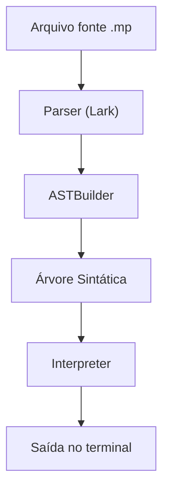

# Trabalho_Compiladores

## Integrantes

- Lucas Víctor Ferreira de Araújo — 211063194 — Turma: 16 ás 18
- Nome 2 — Matrícula — Turma
- Nome 3 — Matrícula — Turma

---

## Descrição

Este projeto implementa uma linguagem de programação simples, interpretada em Python usando a biblioteca [Lark](https://github.com/lark-parser/lark). A linguagem suporta operações aritméticas, operadores de comparação e lógicos, atribuição de variáveis, comandos de impressão (`imprima`), estruturas condicionais (`if`), de repetição (`while`, `do-while`), **strings** (com acentuação), **concatenação de strings**, **funções definidas pelo usuário** e **comentários**.

A análise sintática é feita pelo Lark, a AST é construída por um Transformer customizado, e a execução é feita por um interpretador recursivo em Python.

---

## Instalação

1. **Requisitos:**
   - Python 3.11+
   - Instale a dependência Lark:
     ```
     pip install lark
     ```
   - (Opcional) Use o gerenciador [uv](https://github.com/astral-sh/uv) para ambientes virtuais e execução:
     ```
     uv pip install lark pytest
     ```

2. **Execute um programa da linguagem:**
   ```
   uv run mp exemplos/hello.mp
   ```
   O interpretador irá ler e executar o código do arquivo indicado.

3. **Visualizando a árvore sintática:**
   ```
   uv run mp exemplos/hello.mp --arvore
   ```

4. **Rodando testes automatizados:**
   ```
   uv run pytest
   ```

---

## Exemplos

A pasta `exemplos/` contém exemplos reais de programas na linguagem implementada:

- `hello.mp` — Hello World
- `aritmetica.mp` — Operações aritméticas
- `fibonacci.mp` — Função recursiva de Fibonacci
- `fatorial.mp` — Função recursiva de fatorial
- `ordenacao.mp` — Bubble sort simples
- `do_while.mp` — Laço do-while
- `funcoes.mp` — Função com parâmetros e retorno
- `condicional.mp` — If/else
- `busca_binaria.mp` — Busca binária simulada

---

## Estrutura do Projeto

- `main.py` — Ponto de entrada. Lê o arquivo-fonte, faz o parsing e executa.
- `grammar.lark` — Define a gramática da linguagem.
- `ast_builder.py` — Constrói a árvore sintática abstrata (AST).
- `interpreter.py` — Executa os comandos da linguagem a partir da AST.
- `exemplo.mp` — Exemplo de código-fonte.
- `exemplos/` — Exemplos variados de código-fonte.
- `tests/` — Testes automatizados.

---

## Fluxo de Execução



---

## Gramática Resumida

```
?start: statement+
?statement: assign_stmt | print_stmt | if_stmt | while_stmt | func_def | return_stmt
assign_stmt: NAME "=" expr      -> assign
print_stmt: "imprima" "(" expr ")" -> print
if_stmt: "if" expr ":" block     -> if
while_stmt: "while" expr ":" block -> while
func_def: "def" NAME "(" [params] ")" ":" block   -> func_def
params: NAME ("," NAME)*
return_stmt: "return" expr                        -> return_stmt
block: statement+
?expr: expr "+" term | expr "-" term | expr "==" term | expr "!=" term | expr ">" term | expr "<" term | expr ">=" term | expr "<=" term | expr "and" term | expr "or" term | term
?term: term "*" factor | term "/" factor | factor
?factor: "not" factor | NUMBER | NAME | ESCAPED_STRING | NAME "(" [args] ")" | "(" expr ")"
args: expr ("," expr)*
NAME: /[a-zA-Z_][a-zA-Z0-9_]*/
%import common.NUMBER
%import common.NEWLINE
%import common.WS_INLINE
%import common.ESCAPED_STRING
%ignore WS_INLINE
%ignore NEWLINE
%ignore /#[^\n]*/
```

## Testes Automatizados

O projeto possui testes automatizados para garantir o funcionamento correto de todas as funcionalidades da linguagem. Os testes utilizam o framework pytest e estão localizados na pasta `tests/`.

### Como rodar os testes

1. Instale as dependências no ambiente virtual (usando uv):
   ```
   uv pip install pytest lark
   ```
2. Execute os testes:
   ```
   uv run pytest
   ```

### Estrutura dos testes
Cada teste consiste em um arquivo `.mp` com código-fonte e a saída esperada é verificada automaticamente. Os principais testes são:

| Teste           | Descrição                                 | Exemplo de saída esperada         |
|-----------------|-------------------------------------------|-----------------------------------|
| aritmetica.mp   | Operações aritméticas e atribuição         | 22.0                             |
| string.mp       | Strings e impressão de strings             | "Olá, mundo!"<br>"Teste de string" |
| concat.mp       | Concatenação de strings e números          | "Olá, ""mundo!"<br>"Valor: "123.0   |
| comparacao.mp   | Operadores de comparação                   | True<br>False<br>True             |
| logicos.mp      | Operadores lógicos                         | True<br>True                      |
| comentario.mp   | Comentários na linguagem                   | "Olá!"                            |
| funcao.mp       | Função definida pelo usuário               | 5.0                               |

Para adicionar novos testes, basta criar um novo arquivo `.mp` em `tests/` e adicionar o caso no arquivo `test_interpreter.py`.

## Rodando arquivos .mp com 'uv run mp'

## Referências

- [Lark - Parsing Toolkit for Python](https://github.com/lark-parser/lark): Utilizado para análise léxica e sintática.
- [Documentação oficial do Python](https://docs.python.org/3/): Consultas gerais sobre sintaxe e recursos da linguagem.
- [Exemplo de interpretador com Lark](https://github.com/lark-parser/lark/blob/master/examples/calc.py): Base para estrutura do parser e AST.
- (Adicione outras referências, tutoriais, livros, artigos, códigos usados como base, e explique como cada um foi usado)

---

## Bugs, Limitações e Problemas Conhecidos

- Não há verificação de tipos avançada (ex: soma de string com número é convertida para string, mas outros erros de tipo não são tratados).
- Não há suporte a listas/arrays nativos (pode ser simulado via variáveis).
- Não há tratamento de erros detalhado para todas as situações (ex: divisão por zero, variáveis não declaradas).
- Não há suporte a escopo local em blocos (apenas em funções).
- Não há otimizações de performance (interpretador simples, recursivo).
- (Adicione outros problemas conhecidos ou limitações encontradas)


