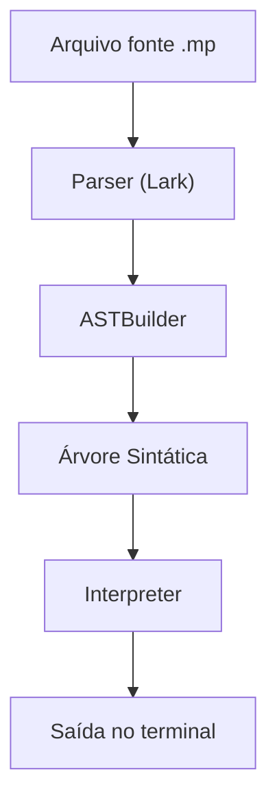

# Trabalho_Compiladores

## Descrição

Este projeto implementa uma linguagem de programação simples, interpretada em Python usando a biblioteca [Lark](https://github.com/lark-parser/lark). A linguagem suporta operações aritméticas, atribuição de variáveis, comandos de impressão (`imprima`), estruturas condicionais (`if`) e de repetição (`while`).

## Sintaxe da Linguagem

- **Atribuição:**
  ```
  x = 10
  y = x * 2 + 5
  ```
- **Impressão:**
  ```
  imprima(y)
  ```
- **Condicional:**
  ```
  if x > 0:
      imprima(x)
  ```
- **Repetição:**
  ```
  while x > 0:
      imprima(x)
      x = x - 1
  ```

## Exemplo de Código

Arquivo: `exemplo.mp`
``` 
x = 7
y = x * 3 + 1
imprima(y)
```

## Como Executar

1. **Requisitos:**
   - Python 3.11+
   - Instale a dependência Lark:
     ```
     pip install lark
     ```

2. **Execute um programa da linguagem:**
   ```
   python main.py exemplo.mp
   ```
   O interpretador irá ler e executar o código do arquivo indicado.

3. **Extensão de arquivo:**
   Você pode usar qualquer extensão para seus programas (ex: `.mp`, `.minilang`, `.lucas`), desde que o conteúdo siga a sintaxe da linguagem.

## Estrutura do Projeto

- `main.py` — Ponto de entrada. Lê o arquivo-fonte, faz o parsing e executa.
- `grammar.lark` — Define a gramática da linguagem.
- `ast_builder.py` — Constrói a árvore sintática abstrata (AST).
- `interpreter.py` — Executa os comandos da linguagem a partir da AST.
- `exemplo.mp` — Exemplo de código-fonte.

## Gramática Resumida

```
?start: statement+
?statement: assign_stmt | print_stmt | if_stmt | while_stmt
assign_stmt: NAME "=" expr      -> assign
print_stmt: "imprima" "(" expr ")" -> print
if_stmt: "if" expr ":" block     -> if
while_stmt: "while" expr ":" block -> while
block: statement+
?expr: expr "+" term | expr "-" term | term
?term: term "*" factor | term "/" factor | factor
?factor: NUMBER | NAME | "(" expr ")"
NAME: /[a-zA-Z_][a-zA-Z0-9_]*/
%import common.NUMBER
%import common.NEWLINE
%import common.WS_INLINE
%ignore WS_INLINE
%ignore NEWLINE
```

## Fluxo de Execução



## Observações
- O comando de impressão é `imprima(expr)`.
- Não há suporte a strings ou múltiplos argumentos em `imprima`.
- O interpretador só aceita expressões matemáticas e variáveis.

---

Sinta-se livre para modificar a gramática e expandir a linguagem!
